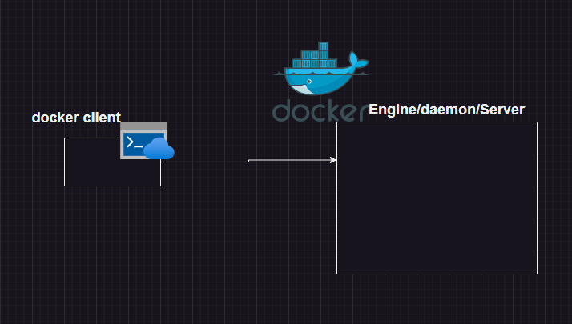

## Docker 
Docker is an open platform for developing, shipping, and running applications.
### What is docker?
* Docker (dock worker) is used to create containers which is standard way of packaging any application.

### Docker Architecture
Earlier docker architecture had only two components

