#  Docker 
Docker is an open platform for developing, shipping, and running applications.
## > What is docker?
* Docker (dock worker) is used to create containers which is standard way of packaging any application.

### > Docker Architecture
* Earlier docker architecture had only two components

* Then docker has made the changes in architecture with layered components.

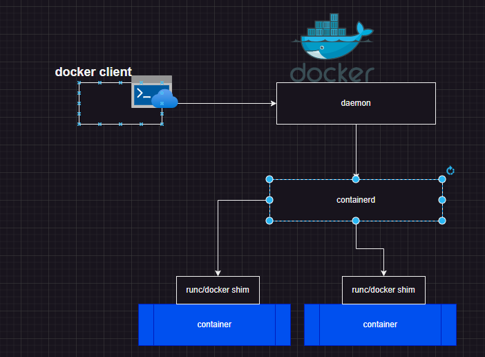

* #### docker client: 
docker client/command line to interact with daemon
* #### docker daemon: 
This is service which forwards the request to containerd 
* #### containerd: 
manages the container lifecycle
* #### runc:
 This creates container using libcontainer
* #### shim: 
once the contianer is created runc makes shim the parent of container, this helps docker containers to be in running state even if the docker components are upgrading.
## > Docker installation :
1. Create a linux vm (ubuntu 22.04)
2. use the docker installation script  (Docker script)
   * $ curl -fsSL https://get.docker.com -o install-docker.sh
   * $ sh install-docker.sh 
   * $ docker version

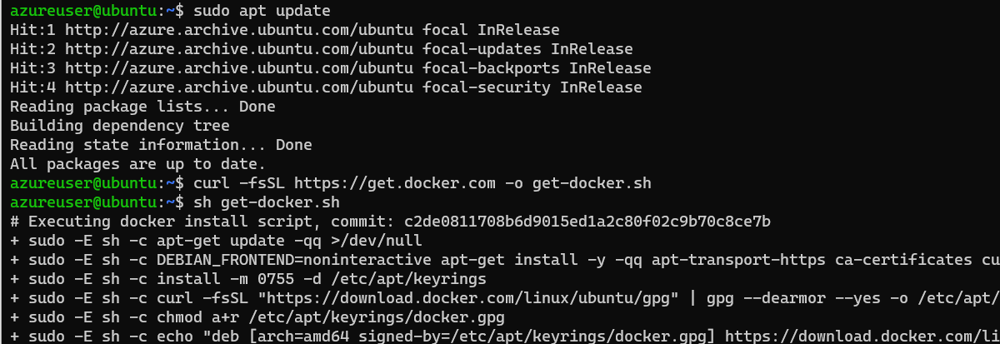   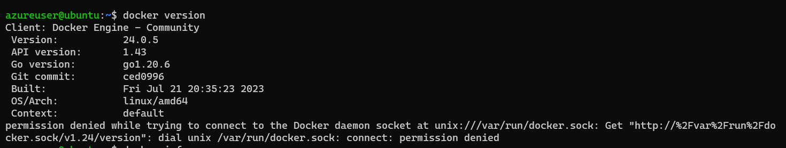
   * you will see the failure to get the server version
   * The reason is the user doesnot have permission to access unix socket at unix:///var/run/docker.sock. The permission to this exists for all the members of docker group, so lets add the current user to docker group.
3. * $ sudo usermod -aG docker <user-name>
   * $ exit  #(relogin)
4. open all ports (inbound rules in azure, n/w security grp in aws)

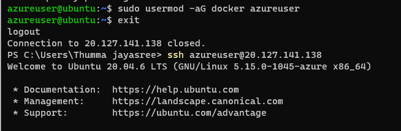   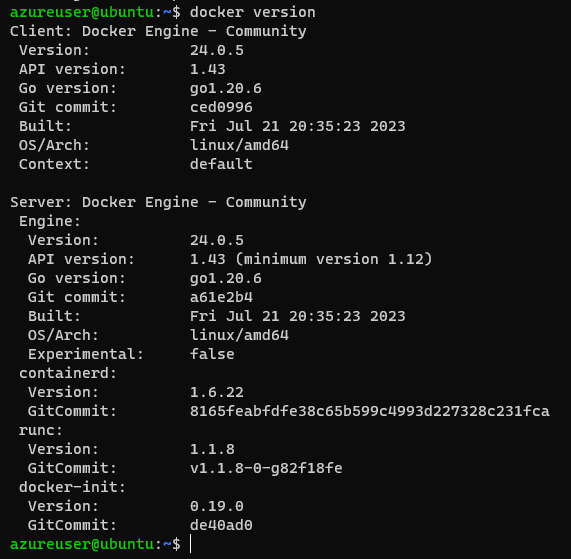

### > Dcoker container way of working
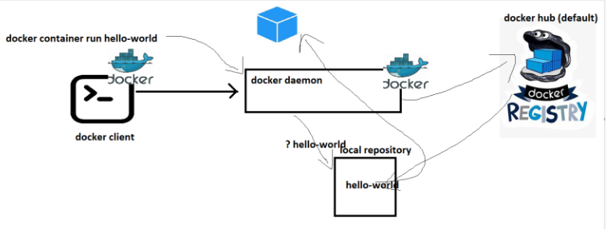
### > What happens
* docker client will forward the request to docker daemon
* docker daemon will check if the image exists locally. if yes creates the container by using image
* if the image doesnot exist, then docker daemon tries to download the image from docker registry connected. The default docker registry is docker hub.
* Downloading image into local repo from registy is called as pull.
* Once the image is pulled the container is created.

### > lets pull the nginx image 
  * $ docker run nginx        (latest version)
  * $ docker run nginx:1.22   (name:x.xx - version)

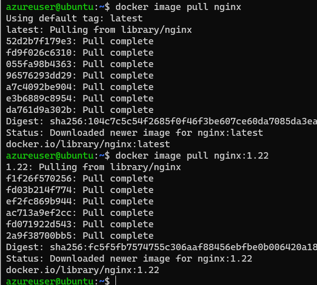

* list of images
  * $ docker image ls 

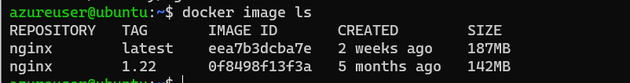  

* deleting selected image and deleting all images at a time
  * $ docker image rm nginx
  * docker image rm $(docker image ls -q)

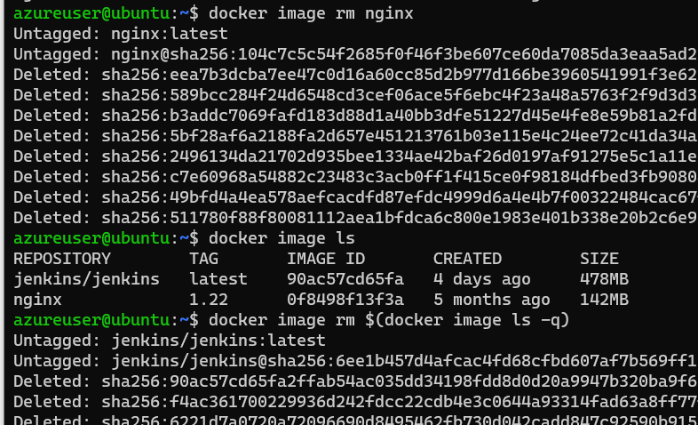

### > docker container lifecycle
* Created
* Running
* Paused
* Stopped
* Deleted

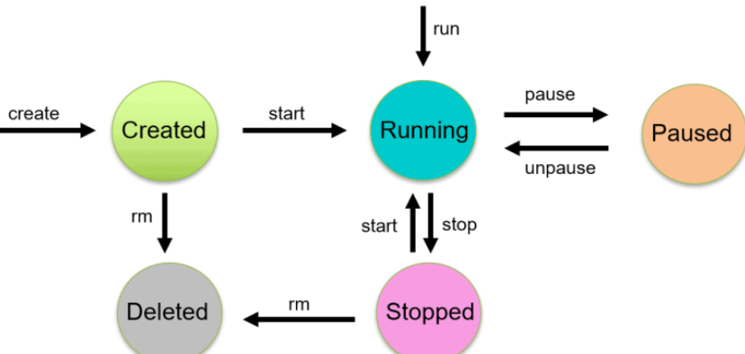

### > Create a container with nginx
* to start and run the container use 'run' command
  * $  docker container run -d --name nginx1 nginx

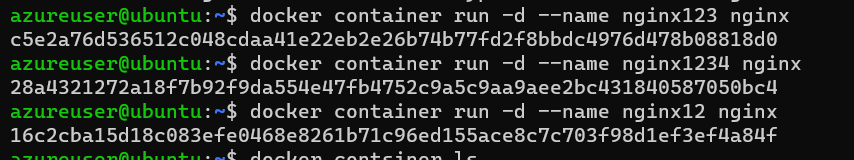

* to check list of running containers  
  * $  docker container ls
*  to check list of all containers(irrespective of state)  
  * $  docker container ls -a

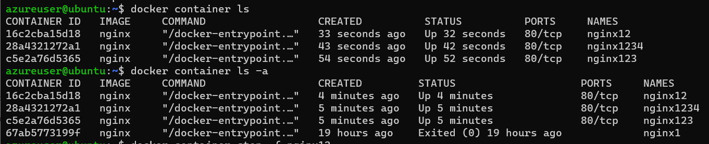

* to stop the container  
  * $  docker container stop nginx12

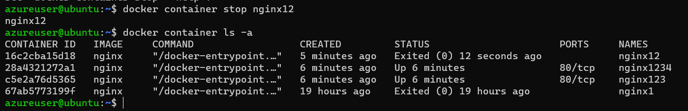

* pause and unpause the container
  * $ docker container pause nginx123
  * $ docker container unpause nginx123

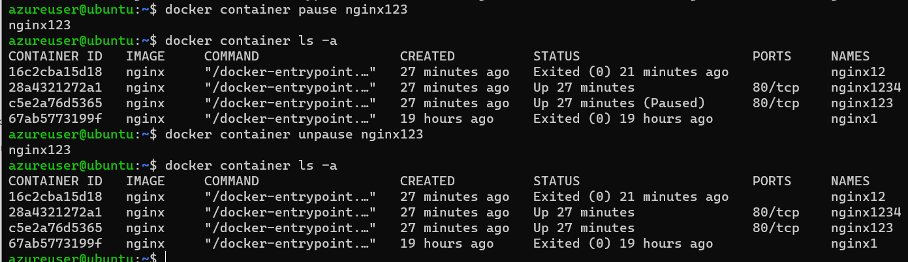

* delete the paticular container
  * $ docker container rm -f nginx123

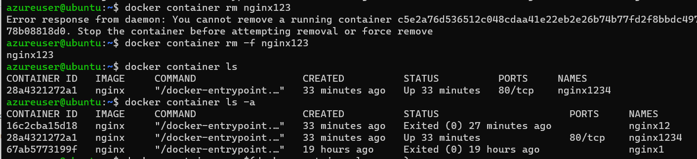

*  delete all containers
  * $ docker container rm $(docker container ls -a -q)

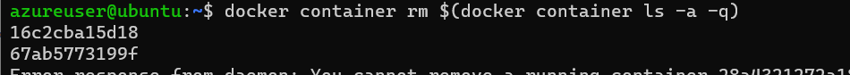

### > port-forwording
 * p - we need to give the port 
   * $  docker container run -d -p 30000:80 --name nginx1 nginx
 * P - it automatically takes the port number
   * $  docker container run -d -P --name nginx1 nginx

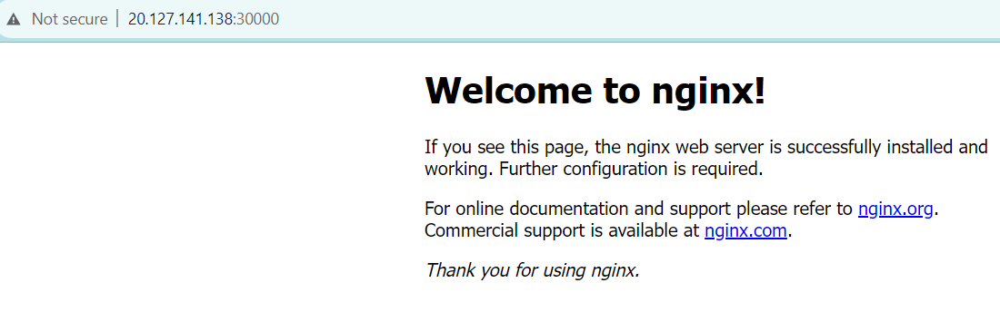
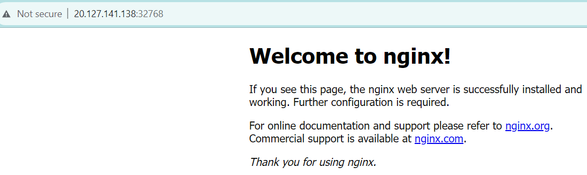
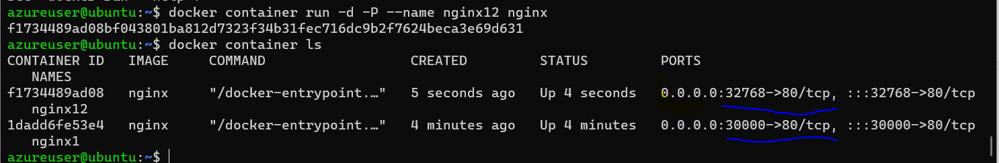

 

 
   
   

